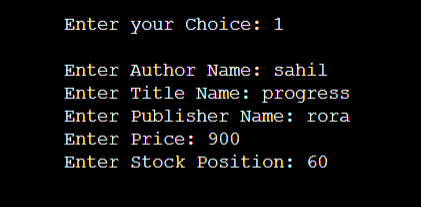
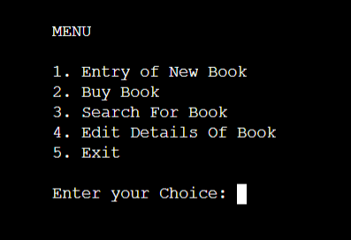

# CPP Projects

## Bookshop_Inventory_System

- About the Project

A book shop maintains the inventory of books that are being sold at the shop. The list includes details such as author, title, price, publisher and stock position. Whenever a customer wants a book, the title and the author of the book is entered and the system searches the list and displays whether it is available or not. If it is not, an appropriate message is displayed. If it is, then the system displays the book details and requests for the number of copies required. If the requested copies book details and requests for the number of copies required. If the requested copies are available, the total cost of the requested copies is displayed; otherwise the message “Required copies not in stock” is displayed.

- Demo Screenshots

 

This is the menu page. Here in this page there are several options in which we can access books as well add books.

## Casino_Number_Guessing Game

- About the Project

This project is about the library used for random numbers: cstdlib. In this project titled "Cassino Number Guessing Game", the program asks for a betting amount and then asks the user to guess a number on rolling. If the random number generated matches the user input, he wins, else money is deducted. The user can keep playing until he loses all the amount he put in initially.

- Demo Screenshots
