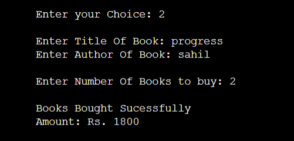
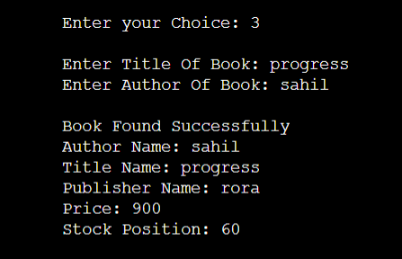
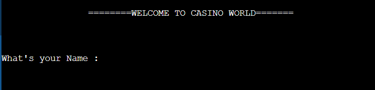
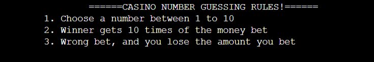

# CPP Projects

## Bookshop_Inventory_System

- About the Project

A book shop maintains the inventory of books that are being sold at the shop. The list includes details such as author, title, price, publisher and stock position. Whenever a customer wants a book, the title and the author of the book is entered and the system searches the list and displays whether it is available or not. If it is not, an appropriate message is displayed. If it is, then the system displays the book details and requests for the number of copies required. If the requested copies book details and requests for the number of copies required. If the requested copies are available, the total cost of the requested copies is displayed; otherwise the message “Required copies not in stock” is displayed.

- Demo Screenshots

This is the menu page where we are given five different choices and system is asking us to choose one of the five above mentioned choices provided.

 

Say, We want to enter details of a new book then we shall choose option number 1, then system is asking us about various details about the book like author's name, title of the book, cost of the book etc...

If we are going for choice number 2 that says "buy a book", then the system will ask us to type the author and title of the book that we want to buy. If the particular book is founf in the record then it will ask the number of copiesof the particular that need to be bought. "Book Bought Successfully" will be shown on the screen and the total amount will also be displayed on the basis of the number of the copies bought.

If we select choice number 3 that says "Search a book" is used when we want to know if a particular book is availble or not. Firstly, It will ask us to type the title as well as the author name of the book and on the basis of the details entered it will check if the required book is availble or not. If found, it will display "Book Found Successfully" and give us the various important details about the book.

## Casino_Number_Guessing Game

- About the Project

This project is about the library used for random numbers: cstdlib. In this project titled "Cassino Number Guessing Game", the program asks for a betting amount and then asks the user to guess a number on rolling. If the random number generated matches the user input, he wins, else money is deducted. The user can keep playing until he loses all the amount he put in initially.

- Demo Screenshots

Welcomes you on the system of the project and asks the name of the user.

The rules of the cassino guessing game are displayed on the screen.
